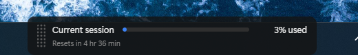
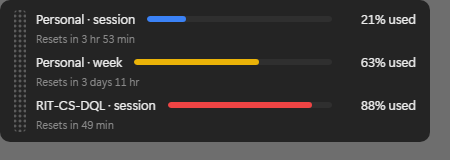

<p align="center">
  
</p>

<h1 align="center">klepsydra</h1>

<p align="center">Your Claude Code usage limit, always on screen.</p>

<p align="center">
  <a href="https://github.com/ajbarea/klepsydra/actions/workflows/ci.yml"></a>
  <a href="LICENSE"></a>
  
</p>

A thin always-on-top bar showing how much of your Claude Code limit you have
used, so you can see it without running `/usage` in whichever terminal happens
to be in front. The bar fills blue to yellow to red as the window is consumed.

## Why "klepsydra"

A *klepsydra* is the Athenian water clock: a vessel that drains to time a
speech in court. A visible, depleting allotment.

## How it gets the number

Claude Code pipes a JSON blob to your `statusLine` command on every render.
That blob carries the same rate-limit figures `/usage` displays:

```json
"rate_limits": {
  "five_hour": { "used_percentage": 73, "resets_at": 1746540000 },
  "seven_day": { "used_percentage": 12, "resets_at": 1746799200 }
}
```

So the status line does double duty: it prints a compact readout to your
terminal, and publishes the figures to a small JSON file. The overlay polls
those files. No API calls, no credentials, no second background process.

```
Claude Code (any terminal)
  │ statusLine JSON on stdin
  ▼
klepsydra-statusline.sh ──► %LOCALAPPDATA%\Klepsydra\accounts\<id>.json ──► klepsydra.exe
  │
  └─► "Opus 5 · ctx 21% · 5h 73% · 7d 12%"
```

## Two accounts at once

The statusLine payload carries no account identity, so the hook reads it from
the global config, which `CLAUDE_CONFIG_DIR` relocates per login:

```bash
CLAUDE_CONFIG_DIR=~/.claude-personal claude   # one account
claude                                         # the other
```

Each account publishes to its own file, so terminals on different logins never
overwrite each other, and the overlay draws a labelled row for each:

<p align="center">
  
</p>

With one account the rows drop the prefix and read "Current session" and "This
week". A separate config dir is a separate *everything* though, so the second
profile starts without your settings, plugins or skills until you copy them.

## Install

**1. Publish the numbers.** Copy the hook and point Claude Code at it:

```bash
cp statusline/klepsydra-statusline.sh ~/.claude/
chmod +x ~/.claude/klepsydra-statusline.sh
```

Then in `~/.claude/settings.json`:

```json
"statusLine": { "type": "command", "command": "~/.claude/klepsydra-statusline.sh" }
```

Set `KLEPSYDRA_OUT` if your Windows user differs from your WSL user.

**2. Build the overlay.** Requires Rust (MSVC toolchain), Node, and the
Microsoft C++ Build Tools:

```powershell
winget install Rustlang.Rustup OpenJS.NodeJS
winget install Microsoft.VisualStudio.2022.BuildTools --override `
  "--quiet --wait --norestart --add Microsoft.VisualStudio.Workload.VCTools --includeRecommended"
```

```bash
bash scripts/build-windows.sh
```

**3. Start it with Windows.** Put a shortcut to `klepsydra.exe` in
`shell:startup`.

## Using it

Grab the dotted handle on the left edge to drag the gauge anywhere; it
remembers where you put it. Everything except that handle is click-through, so
the gauge never intercepts a click meant for the window underneath.

Dragging is handled in the backend rather than by `data-tauri-drag-region`,
which needs a focused window -- this one is deliberately unfocused and
click-through, so webview drag events never arrive. The pointer watcher reads
the mouse button straight from the OS instead, and a drag only begins on a
press that starts on the handle.

Windows offers no per-region hit testing for a click-through window -- ignoring
cursor events is all or nothing. So a background thread watches the pointer and
makes the window interactive only while it is over the handle. The frontend
reports the handle's rectangle rather than the backend hard-coding it, so
restyling cannot desync the two.

The tray icon offers "Reset position" (for when the gauge has been dragged
off-screen or onto a monitor that is no longer attached), toggles "Start with
Windows", and quits. Autostart is on by default; the icon may start in the
notification-area overflow.

### Staying in front of the taskbar

The taskbar is itself a topmost window, and within that band z-order goes to
whichever window was raised last -- so clicking the taskbar buries a gauge
sitting over it, and takes the drag handle out of reach. Tauri's
`set_always_on_top` diffs against the flag it already holds and does nothing,
so klepsydra calls `SetWindowPos` with `HWND_TOPMOST` twice a second instead.
`NOMOVE`/`NOSIZE` preserve your position and `NOACTIVATE` keeps focus where it
was.

## How often it refreshes

The status line is event-driven: Claude Code runs it as you work, and the hook
publishes on every render. `refreshInterval` adds a periodic re-run so the
reading stays fresh in an idle terminal:

```json
"statusLine": {
  "type": "command",
  "command": "~/.claude/klepsydra-statusline.sh",
  "refreshInterval": 30
}
```

That refreshes the timestamp, not the number. The percentage only moves when a
new API response arrives, which is correct -- usage does not grow while you are
idle. The overlay re-reads the files every 5 seconds, and the countdown ticks
every 15 seconds off `resets_at`, so it stays right even when nothing is
publishing.

## Switching accounts

Signing into a different account is picked up on the next render, and publishes
under the new account's file. The previous account keeps its row, because its
5-hour window carries on burning down whether or not you are signed into it.
That row drops once the window actually resets.

## Restyling

Every visual token lives at the top of `src/style.css`: bar height and radius,
the three ramp colours and their thresholds, panel background and padding,
fonts and sizes. `--ramp-mode` picks between `blend` (continuous
interpolation) and `bands` (flat colours that switch at thresholds). Edit,
rebuild, done.

## When it does not know

A gauge showing a confident wrong number is worse than one admitting
ignorance, so the panel dims whenever it cannot establish a live reading:

| Condition | Shown |
|---|---|
| No file yet | `waiting for Claude Code` |
| File older than 15 minutes | number kept, panel dimmed |
| The window's own reset time has passed | `window reset`, no number |
| Unreadable or malformed file | last good reading, dimmed |

`rate_limits` is absent before the first API response of a session and when no
window is active. The hook treats that as "nothing to say" and leaves the
previous file alone rather than overwriting it with blanks.

## Tests

```bash
bash statusline/test_statusline.sh   # hook, against recorded payload shapes
node --test src/*.test.js            # ramp, countdown, staleness rules
bash scripts/visual-check.sh         # screenshots every state
```
